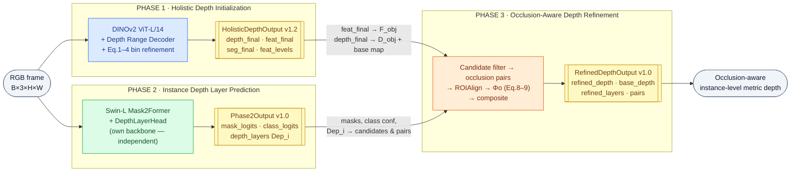
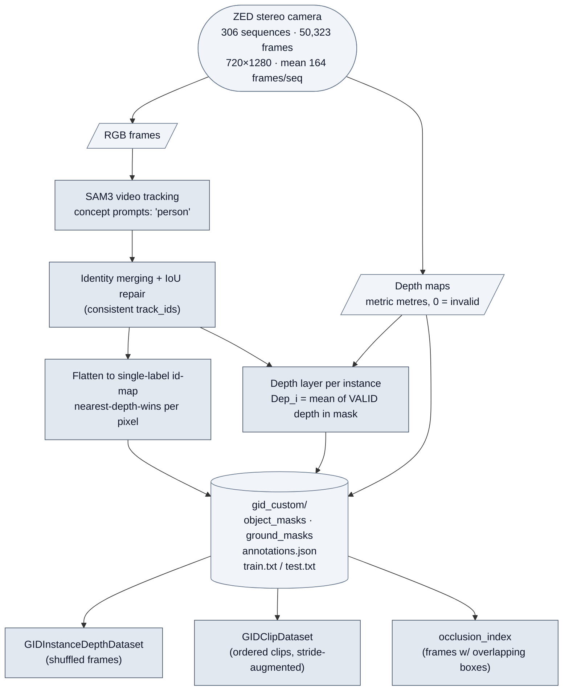
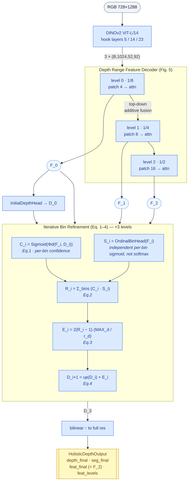
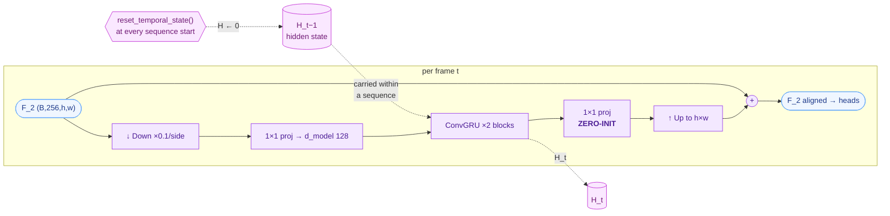
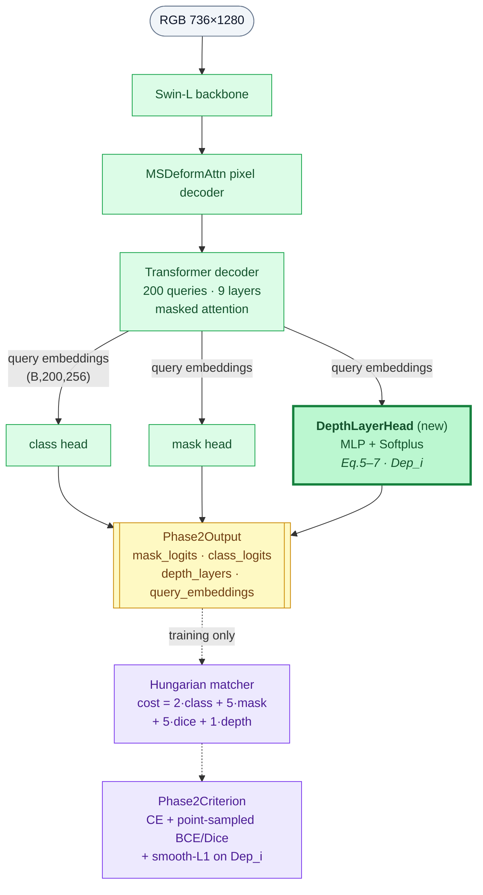
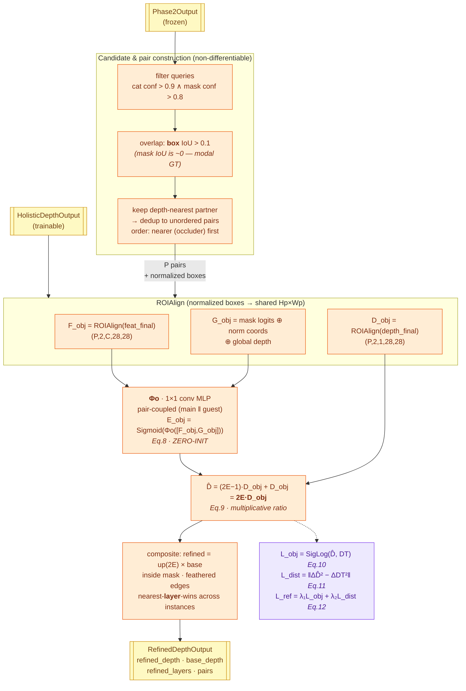
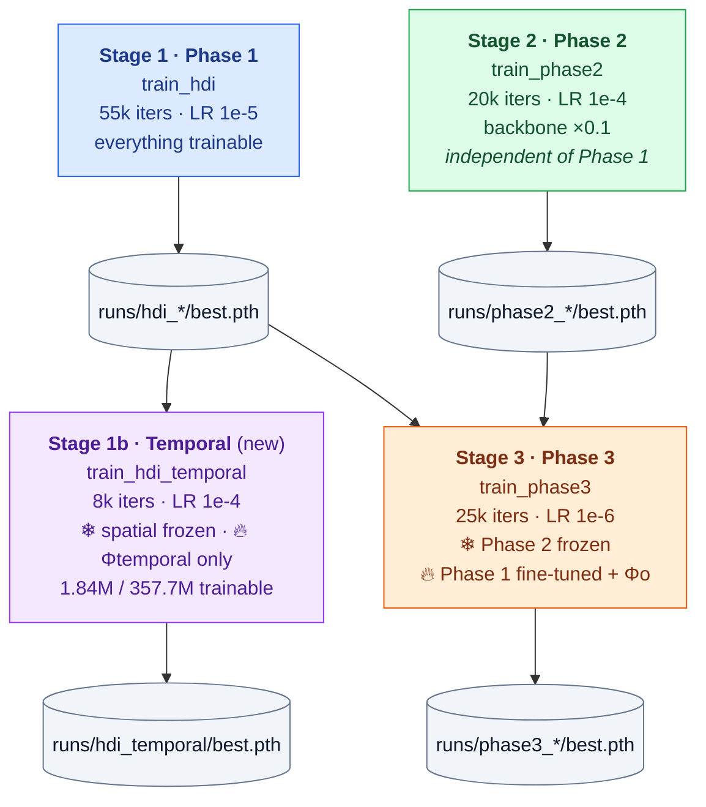
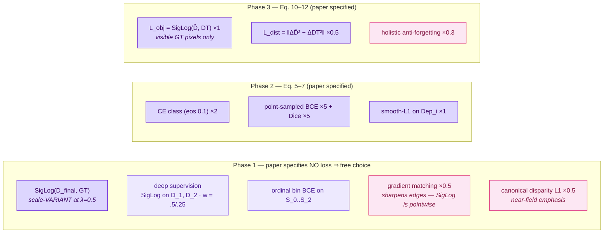
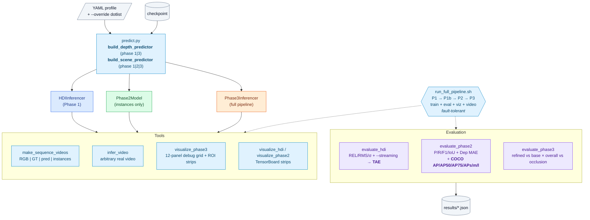
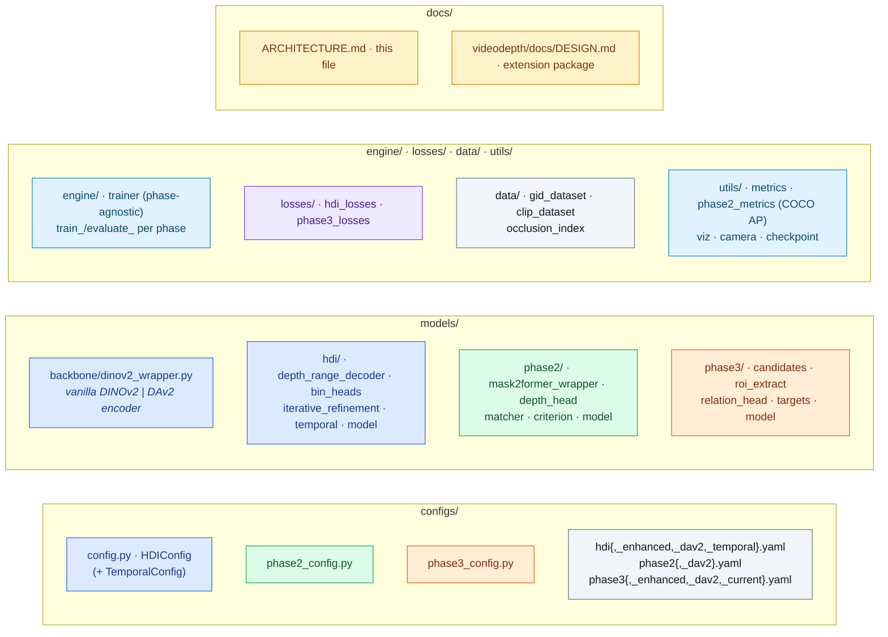

# InstanceDepth — Architecture

Visual reference for the whole project: how data, models, contracts and
training stages fit together. Rendered by GitHub natively (Mermaid).

Split into focused diagrams rather than one wall of boxes:

| # | Diagram | Answers |
|---|---------|---------|
| [1](#1-system-overview) | System overview | How do the three phases connect end to end? |
| [2](#2-data-engine-raw-capture--annotations) | Data engine | Where does the training data come from? |
| [3](#3-phase-1--holistic-depth-initialization) | Phase 1 internals | How is dense metric depth produced? (Eq. 1–4) |
| [4](#4-temporal-module-flashdepth-improvement) | Temporal module | The FlashDepth improvement over the baseline |
| [5](#5-phase-2--instance-depth-layer-prediction) | Phase 2 internals | How are instances + `Dep_i` produced? (Eq. 5–7) |
| [6](#6-phase-3--occlusion-aware-depth-refinement) | Phase 3 internals | How is occluded depth corrected? (Eq. 8–12) |
| [7](#7-training-stages--freezing-strategy) | Training stages | What is frozen/trained when, and at which LR? |
| [8](#8-loss-landscape) | Losses | Every loss term, where it applies, and its provenance |
| [9](#9-inference--tooling) | Inference & tooling | How do I get predictions, videos, metrics? |
| [10](#10-repository-map) | Repository map | Which file does what? |

Legend used throughout:

- **Blue** = Phase 1 (depth branch) · **Green** = Phase 2 (instance branch) ·
  **Orange** = Phase 3 (refinement) · **Grey** = data/IO · **Purple** = losses/metrics
- Solid arrows = tensor flow · dashed arrows = gradients / control / weights

---

## 1. System overview

The paper's two-stage design: Phase 1 and Phase 2 are **independent parallel
branches** that only meet in Phase 3. The three dataclass contracts
(`HolisticDepthOutput`, `Phase2Output`, `RefinedDepthOutput`) are the only
coupling points — each is versioned so a stale consumer fails loudly.

> **Why Phase 2 is independent:** it carries its own Swin-L backbone
> (COCO-pretrained Mask2Former). This deviates from the paper's
> shared-encoder prose but is what makes the Sec. 4.3 freeze strategy
> coherent — Phase 3 fine-tunes Phase 1's encoder while Phase 2 stays
> frozen, which would otherwise drift the "frozen" decoder's features.
> Consequence: **Phase 2's output is invariant to the Phase-1 checkpoint.**

---

## 2. Data engine (raw capture → annotations)

Run once, offline. Produces the GID-style annotations every phase consumes.

> **Two consequences of this pipeline that shape the whole project:**
> 1. **GT masks are modal and disjoint** — the id-map gives each pixel to
>    exactly one instance, so two occluding people have ~0 *mask* IoU.
>    Occlusion must be detected by **bounding boxes**.
> 2. **No GT behind occluders** — a single sensor only sees front surfaces,
>    so Phase 3's `L_obj` can only be supervised on *visible* pixels.

---

## 3. Phase 1 — Holistic Depth Initialization

Paper Sec. 4.1, Eq. 1–4. Depth is built **iteratively**: a seed `D_0`, then
three coarse-to-fine correction rounds.

> `r_d = 5` bins over `MAX_d = 10 m` = the paper's best "2-metre partitioning"
> ablation (Table 5). `S_i` is an **ordinal** (independent-sigmoid) encoding,
> not a softmax — a softmax would force Eq. 2–4's correction to be
> one-directional, which the equations don't support.

---

## 4. Temporal module (FlashDepth improvement)

The first research improvement over the reproduced baseline. **Off by default**
(`temporal.enabled: false`) so the faithful baseline stays bit-identical.

**Why zero-init is the crux:** at step 0 the module outputs exactly 0, so
`F_2_aligned == F_2` — the model *is* the pretrained per-frame model, and an
empty-memory first frame can never be worse than the baseline. Zero *hidden
state* at sequence starts is FlashDepth's actual behaviour (there is no
learned initial state); the zero-init *output projection* is what makes that
safe.

| | Training | Inference |
|---|---|---|
| Input | 5-frame clips, strides {1,2,4,8} | full sequence, in order |
| State | reset per clip; full BPTT within it | carried across the sequence |
| Reset | every clip | every sequence boundary |
| Batch | independent clips | **1** (state is per-stream) |

---

## 5. Phase 2 — Instance Depth Layer Prediction

Paper Sec. 4.2.1, Eq. 5–7. Official COCO-pretrained Mask2Former + one new head.

> **`Dep_i` never reads Phase 1.** It is an MLP on Mask2Former's own query
> embeddings, trained directly against GT depth layers ("Reading A" of the
> paper's ambiguous "query fusion"). This is why Phase-2 output cannot show
> any effect of the temporal module.

---

## 6. Phase 3 — Occlusion-Aware Depth Refinement

Paper Sec. 4.2.2, Eq. 8–12. The join point.

> **Eq. 9 is a ratio, not a paste.** `D̂ = 2E·D_obj` means the refinement is a
> *multiplicative correction field*. Compositing therefore applies the
> upsampled **ratio** to full-resolution base depth — so `E = 0.5` is an exact
> no-op and the base map's fine geometry is preserved, merely modulated.
> (Pasting the 28×28 ROI depth instead was the primary defect in the first
> implementation.)

---

## 7. Training stages & freezing strategy

Paper Sec. 4.3 prescribes the three stages; the temporal stage is the
project's addition.

> ⚠️ **Stage 3 hazard (observed, then fixed):** Phase 3 fine-tunes the *whole*
> depth branch but its losses only touch paired-instance ROIs — the first run
> drifted `overall_base` abs_rel **0.078 → 0.139** while supervised instance
> regions stayed at 0.078. Classic catastrophic forgetting. The run profiles
> now enable `holistic_weight: 0.3` (a dense anti-forgetting term, a flagged
> deviation from Eq. 12).

---

## 8. Loss landscape

**Legend:** ▉ paper-specified · ▉ inferred · ▉ opt-in deviation (off in faithful profiles)

> **On SigLog vs SSI** — a recurring question. *SSI* (MiDaS/DPT) least-squares
> aligns scale **and shift** before comparing, discarding metric scale: that is
> the *multi-source* loss, and this project never uses it. *SILog* (Eigen 2014)
> at λ<1 **penalizes** absolute scale — substituting `pred → α·pred` leaves a
> residual `(1−λ)[(log α)² − 2 log α·mean(d)]` that vanishes only at λ=1. It is
> the standard single-sensor metric-depth loss (BTS, AdaBins, NeWCRFs,
> ZoeDepth). Pinned by `test_siglog_penalizes_absolute_scale`.

---

## 9. Inference & tooling

**Fault tolerance in the pipeline:** training failures gate only their true
dependents (Phase 2 runs even if Phase 1 fails; Phase 3 needs both
checkpoints). Eval / visualization / video failures are recorded and skipped
past, and a pass/fail/skip summary sets the exit code.

---

## 10. Repository map

---

## Key invariants (the things that must stay true)

| Invariant | Why it matters | Pinned by |
|---|---|---|
| Contracts are versioned dataclasses | a stale consumer fails loudly, never silently misreads a tensor | `test_output_contract.py` |
| `temporal.enabled: false` everywhere by default | the paper-faithful baseline stays bit-identical and comparable | `test_temporal_config_wiring` |
| Zero-init ⇒ new modules start as exact no-ops (Φo, temporal) | training can only *earn* a change; never a cold-start regression | `test_aligner_identity_at_init`, `test_composite_identity_at_e_half` |
| Occlusion detected by **box** IoU, never mask IoU | GT masks are modal/disjoint ⇒ mask IoU is structurally ~0 | `test_box_iou_catches_modal_disjoint_masks...` |
| Phase-3 supervision masked to **visible** GT | one sensor has no ground truth behind occluders | `targets.build_dense_gt_rois` |
| Phase 2 never reads Phase 1 | its output is invariant to the Phase-1 checkpoint (incl. temporal) | `predict.py` docstring |
